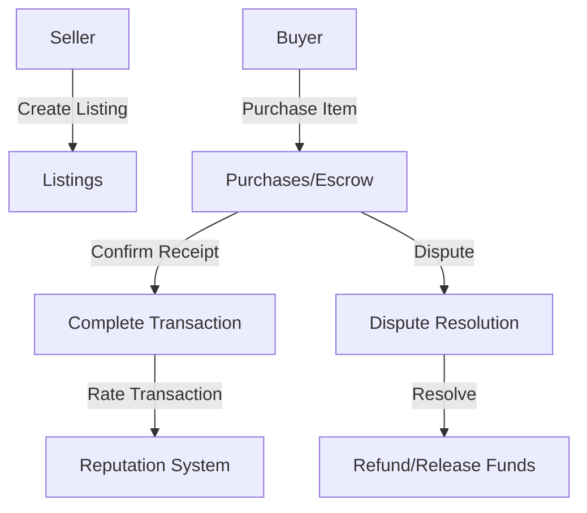

# Pure Specification Utility

A decentralized framework for managing complex specification processes using blockchain technology, enabling transparent and verifiable specification workflows.

## Overview

Pure Specification Utility enables robust and transparent specification management through blockchain smart contracts, featuring:

- Decentralized specification tracking
- Verifiable workflow states
- Collaborative consensus mechanisms
- Immutable record-keeping
- Flexible validation processes

## Architecture

The marketplace is built around a central smart contract that manages listings, purchases, escrow, and reputation systems.



### Core Components

1. **Listings Management**: Tracks product information and availability
2. **Purchase Escrow**: Handles secure fund transfers between parties
3. **Reputation System**: Maintains user ratings and transaction history
4. **Dispute Resolution**: Manages conflict resolution process

## Contract Documentation

### Main Contract: aetherstore.clar

The primary contract handling all marketplace functionality.

#### Key Features:

- Product listing creation and management
- Purchase processing and escrow
- User reputation tracking
- Dispute resolution mechanism
- Transaction rating system

#### Access Control

- Sellers can only modify their own listings
- Buyers can only confirm their own purchases
- Dispute resolution requires contract-caller privileges
- Rating system restricted to transaction participants

## Getting Started

### Prerequisites

- Clarinet
- Stacks wallet
- STX tokens for transactions

### Basic Usage

#### Creating a Listing

```clarity
(contract-call? .aetherstore create-listing 
    "Product Title"
    "Product Description"
    u1000000 ;; Price in microSTX
    (some "image-url")
    "category"
    u1 ;; Quantity
)
```

#### Making a Purchase

```clarity
(contract-call? .aetherstore purchase-item 
    u1 ;; listing-id
    u1 ;; quantity
    "Delivery Address"
)
```

## Function Reference

### Listing Management

```clarity
(create-listing (title (string-ascii 100)) (description (string-utf8 1000)) (price uint) (image-url (optional (string-ascii 256))) (category (string-ascii 50)) (quantity uint))
(update-listing (listing-id uint) ...)
```

### Purchase Operations

```clarity
(purchase-item (listing-id uint) (quantity uint) (delivery-address (string-utf8 500)))
(confirm-receipt (purchase-id uint))
```

### Dispute Resolution

```clarity
(initiate-dispute (purchase-id uint) (reason (string-utf8 500)))
(resolve-dispute-refund (purchase-id uint))
(resolve-dispute-release (purchase-id uint))
```

### Reputation System

```clarity
(rate-seller (purchase-id uint) (rating uint) (comment (optional (string-utf8 500))))
(rate-buyer (purchase-id uint) (rating uint) (comment (optional (string-utf8 500))))
```

## Development

### Testing

1. Clone the repository
2. Install Clarinet
3. Run tests:
```bash
clarinet test
```

### Local Development

1. Start Clarinet console:
```bash
clarinet console
```

2. Deploy contracts:
```bash
clarinet deploy
```

## Security Considerations

### Limitations

- Dispute resolution mechanism requires trusted arbitrator
- Rating system vulnerable to Sybil attacks
- Fixed dispute resolution period

### Best Practices

1. Always verify transaction status before finalizing
2. Wait for sufficient block confirmations
3. Review listing details thoroughly before purchase
4. Keep delivery addresses encrypted off-chain
5. Monitor dispute timeframes carefully